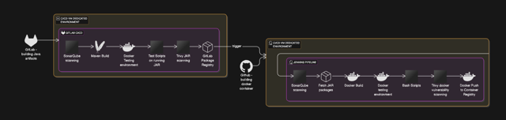

# CI-CD

This repository provides a versatile set of CI/CD configurations and supporting scripts for building, scanning, and deploying applications. It includes:

- **CI-CD Diagram/** 

- **GitLab CI/CD**:  
  Maven build configurations, sonarqube scanning, building, deployment steps, and vulnerability scanning stages for custom Graylog plugins written in Java language, stored in Gitlab Package Registry as artifacts (see [gitlab-cicd-template-maven/.gitlab-ci.yml](gitlab-cicd-template-maven/.gitlab-ci.yml)).

- **Jenkins Pipelines (Multibranch)**:  
  Multiple Jenkinsfiles aimed at different tasks:
  - **Graylog App with Plugins**: Utilizes a Jenkinsfile to define stages that handle compiling, testing, and packaging the Graylog application along with its plugins. built in "Gitlab CI/CD Tempates". Project is designed to work with Jenkins Multibranch Pipelien jobs allowing dynamic handling of multipel feature branches and pull requests. (see [jenkins_multibranch/graylog-app-with-plugins/Jenkinsfile](jenkins_multibranch/graylog-app-with-plugins/Jenkinsfile)).
  - **Python TLS Checker**: Contains Dockerfile, Jenkinsfile, and scripts (e.g. [jenkins_multibranch/python-tls-checker/Jenkinsfile](jenkins_multibranch/python-tls-checker/Jenkinsfile)) for TLS monitoring and notifications.
  - **Jenkins Build and Custom Tools**: Additional jobs and utilities with Docker support (check [jenkins_multibranch/jenkins-build/Jenkinsfile](jenkins_multibranch/jenkins-build/Jenkinsfile) and [jenkins_multibranch/custom-tool/Jenkinsfile](jenkins_multibranch/custom-tool/Jenkinsfile)).
- **Supplementary Scripts**:  
  Standalone Python script ready to be packaged into Docker container that monitors k8s cluster via API calls, information processing and notifications (e.g. [python-script-with-no-CICD/k8s-monitoring.py](python-script-with-no-CICD/k8s-monitoring.py)) .

Overall, the repository supports multi-platform CI/CD workflows leveraging both GitLab and Jenkins, with a focus on Docker-based deployments and security scanning.

---

## Best Practices for CI/CD Pipelines
- **Modularity & Clarity:**  
  Break your pipelines into clear, discrete stages (e.g., build, test, deploy) to simplify debugging and maintenance.
- **Caching & Optimization:**  
  Leverage caching strategies to avoid redundant tasks and reduce build times by reusing previously built artifacts.
- **Parallel Execution:**  
  Where possible, run independent jobs in parallel to speed up overall pipeline execution.
- **Secrets & Security:**  
  Store credentials and sensitive data securely using environment variables or secret management tools rather than hard-coding them.
- **Code Quality Checks:**  
  Integrate static analysis and automated testing into your pipelines. Enforce standards and catch issues early using tools like SonarQube or linting tools.

---

## Best Practices for Docker Build Processes
- **Minimal Base Images:**  
  Choose lightweight and minimal base images to reduce the final image size and minimize attack surfaces.
- **Multi-Stage Builds:**  
  Use multi-stage builds to separate build dependencies from runtime dependencies, ensuring the final image contains only what is necessary.
- **Efficient Layering:**  
  Organize Dockerfile instructions to maximize caching: start with commands that change infrequently (e.g., installing dependencies) and end with commands that change often (e.g., copying source code).
- **Clean Build Context:**  
  Use a `.dockerignore` file to exclude unnecessary files and directories from your build context, reducing image size and build time.
- **Tagging & Versioning:**  
  Tag images consistently and include version numbers. Use immutable tags (like commit SHAs) for deployments to ensure reproducibility.
- **Security Considerations:**  
  Avoid running containers as root. Keep your images updated with security patches, and scan images for vulnerabilities regularly.
- **Build Arguments & Environment Variables:**  
  Use build arguments and environment variables to make your Dockerfiles flexible and configurable without modifying the file.
